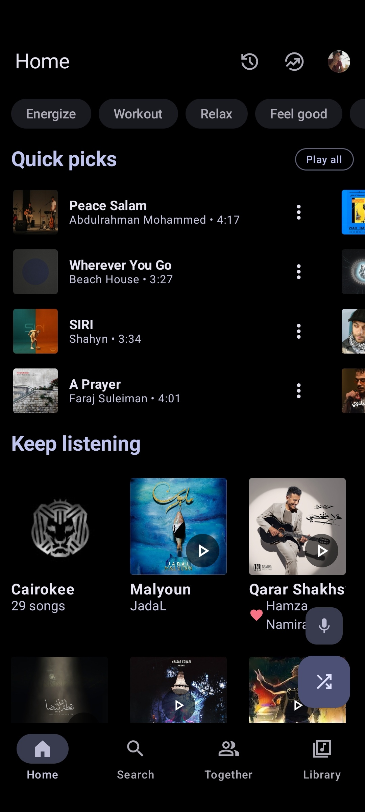
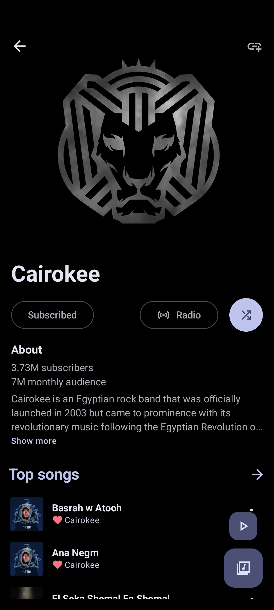
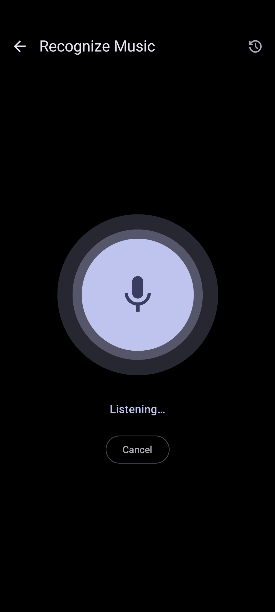

<div align="center">


# TMUSIC

### A modern, open-source YouTube Music client for Android

TMUSIC is built on a **clean monochrome interface**, **smooth animations**, and a **focused, distraction-free music player** — with playlist import, powerful search, and deep audio controls.

This project is a fork of [Metrolist](https://github.com/MetrolistGroup/Metrolist).

<br/>

[](https://github.com/mdanseergit/Tmusic/blob/main/LICENSE)
[](https://www.android.com)
[](https://kotlinlang.org)
[](https://m3.material.io)

<br/>

[**Setup**](#-setup-and-build) · [**Build**](#-build-from-source) · [**Guide**](#-using-tmusic) · [**FAQ**](#-faq) · [**Credits**](#-credits-and-license)

</div>

---

## What is TMUSIC?

TMUSIC is a third-party Android client for **YouTube Music**. It streams songs, albums, artists, videos, and playlists straight from YouTube Music's API, with:

- A **minimal monochrome UI** built with Material 3 and Jetpack Compose
- The **Inter** typeface and smooth glassmorphism-style animations
- **Background playback** and **offline downloads**
- **Deep audio controls**: equalizer, crossfade, sleep timer, skip silence, tempo & pitch
- **Playlist import** from other music services
- **Live synced lyrics**, music recognition, and Last.fm scrobbling

> [!WARNING]
> **Regional restriction** — If YouTube Music is unavailable in your region, TMUSIC will not work without a **VPN or proxy** connected to a supported region.

> [!NOTE]
> This project is **not affiliated with or endorsed by YouTube or Google**. It uses YouTube Music through the public `innertube` API, the same unofficial endpoint used by many open-source YouTube clients.

---

## Features

| Category | Capabilities |
| --- | --- |
| **Playback** | Stream any song or video from YouTube Music, background playback, download & cache for offline use, skip silence, sleep timer |
| **Audio** | Equalizer, tempo & pitch control, audio normalization, crossfade |
| **Lyrics & Discovery** | Live synced lyrics, search songs / albums / artists / videos / playlists, personalized quick picks |
| **Library & Account** | Full library management, local playlists, **playlist import**, YouTube Music account login, sync of songs / artists / albums / playlists, reorder songs in playlist or queue |
| **Social** | Listen together with friends in real time, Last.fm scrobbling, Discord Rich Presence |
| **Interface** | Home screen widgets, Light / Dark / Black / Dynamic themes, dynamic color palettes, Inter font, Material 3 |

---

## Setup and Build

### Prerequisites

| Requirement | Version / Notes |
| --- | --- |
| **JDK** | 21 (Temurin or equivalent). The project uses the Java 21 toolchain and core-library desugaring. |
| **Android SDK** | Platform 37 (`compileSdk`), `targetSdk` 36, `minSdk` 26. Android Studio will offer to install these. |
| **Build Tools** | 35.0.0 (used by CI; newer versions also work). |
| **Gradle** | 9.7.0 — downloaded automatically by the included wrapper (`gradlew` / `gradlew.bat`). |

### 1. Get the source

```bash
git clone https://github.com/mdanseergit/Tmusic.git
cd Tmusic
```

### 2. Point Gradle at your Android SDK

Create `local.properties` in the project root (it is ignored by git and local to your machine):

```properties
# Windows — example
sdk.dir=C:\Users\<you>\AppData\Local\Android\Sdk

# macOS / Linux — example
# sdk.dir=/Users/<you>/Library/Android/sdk
```

### 3. Build with Android Studio (easiest)

1. Open **Android Studio** and choose **Open** → select the project root.
2. Wait for Gradle sync to finish (needs JDK 21 configured in **Settings → Build Tools → Gradle** if your default JDK differs).
3. In the **Build Variants** panel pick a variant — e.g. `fossDebug`.
4. Press **Run** to install on a connected device or emulator.

### 4. Build from the command line

Windows:

```bat
gradlew.bat :app:assembleFossDebug
```

macOS / Linux:

```bash
./gradlew :app:assembleFossDebug
```

This produces a debug APK you can install directly:

```bash
adb install app/build/outputs/apk/foss/debug/app-foss-debug.apk
```

### Build variants

TMUSIC ships three **flavors** (dimension `variant`) × two build types (`debug`/`release`):

| Flavor | Description | Notes |
| --- | --- | --- |
| `foss` (default) | In-app updater, **no** Google Cast | Recommended daily driver |
| `gms` | In-app updater **and** Google Cast | Requires Google Play services |
| `izzy` | **No** updater, no Cast | The only F-Droid-compliant build |

Useful commands:

```bash
./gradlew :app:assembleFossDebug       # FOSS debug (fastest, no signing)
./gradlew :app:assembleFossRelease     # FOSS release (minified, needs signing)
./gradlew :app:assembleGmsDebug        # GMS debug (adds Cast)
./gradlew :app:assembleIzzyRelease     # Izzy release
./gradlew lintGmsRelease               # Run lint manually (not run in CI)
```

Outputs land in `app/build/outputs/apk/<flavor>/<buildType>/`.

### Optional configuration

The build reads the following from **environment variables** (or `local.properties` for the Last.fm keys):

| Variable | Purpose |
| --- | --- |
| `METROLIST_APPLICATION_ID` | Override the application ID (default `com.metrolist.music`). |
| `METROLIST_APP_NAME` | Override the launcher app name (default `TMUSIC`). |
| `METROLIST_BUILD_COMMIT` | 7–40 char git SHA appended to the version name. |
| `METROLIST_DEBUG_KEYSTORE_PATH` / `METROLIST_DEBUG_KEYSTORE_PASSWORD` / `METROLIST_DEBUG_KEY_ALIAS` / `METROLIST_DEBUG_KEY_PASSWORD` | Custom debug signing config (defaults: `androiddebugkey` / `android`). |
| `LASTFM_API_KEY` / `LASTFM_SECRET` | Enable **Last.fm scrobbling**. Get keys free at https://www.last.fm/api. |

`local.properties` (same keys, no shell escaping needed):

```properties
sdk.dir=C:/Users/danse/AppData/Local/Android/Sdk
LASTFM_API_KEY=your_lastfm_api_key
LASTFM_SECRET=your_lastfm_secret
```

### Signing a release build

- **Debug builds** need no configuration — a debug keystore is used automatically (`app/persistent-debug.keystore` if present, otherwise `~/.android/debug.keystore`).
- **Release builds** need a release keystore. The build expects `app/keystore/release.keystore` and the passwords in the environment:

```bash
set STORE_PASSWORD=your_store_password      # Windows
set KEY_ALIAS=your_alias
set KEY_PASSWORD=your_key_password
./gradlew :app:assembleFossRelease
```

Generate your own keystore if you don't have one:

```bash
keytool -genkey -v -keystore release.keystore \
        -alias your_alias -keyalg RSA -keysize 2048 -validity 10000
```

> [!IMPORTANT]
> Never commit your keystore or passwords. The keystore, passwords, and API keys are **not** tracked by git.

### A note on YouTube Music access

TMUSIC talks to YouTube Music through the `innertube` API (bundled `innertube/` module plus the `innertubex` library from JitPack) and the `zemer-cipher` library for cipher de-obfuscation / PoToken generation. No API key is required. If you fork this project, be aware that these endpoints and ciphers can change upstream — keep the dependencies up to date.

### GitHub Actions (CI) — important

The `.github/workflows/` files are inherited from the upstream Metrolist project and are **customized for that repo**: they use Blacksmith runners, Metrolist release names (`Metrolist Nightly`, `app-universal-with-Google-Cast.apk`), and repository secrets (`LASTFM_API_KEY`, `KEYSTORE`, ...). On this repo they will **not run successfully until you**:

- add the required **repository secrets** (Settings → Secrets and variables → Actions), or
- remove/edit the workflows, or
- disable Actions entirely.

If you only want the source here and to build locally, the simplest option is to delete or disable the Actions workflows.

---

## Using TMUSIC

### First launch

1. Install the APK and open **TMUSIC**.
2. You can **log in with your YouTube Music account** (Settings → Account) to sync your library, likes, and playlists — or use it anonymously.

### Playback

- Tap any song, album, artist, or video to start playback.
- The **mini player** shows the current track; swipe it up for the full player with **seek bar, lyrics, and queue**.
- On the player you can enable **repeat**, **shuffle**, adjust the audio via the **equalizer / bass boost**, change **tempo & pitch**, and toggle **skip silence**.
- Use the **sleep timer** to stop playback automatically (Settings → Player).

### Downloads & offline

- Long-press a song / album / playlist → **Download** to cache it for offline listening.
- Manage offline content under your **Library → Downloads**.
- Downloads are stored locally — you can change the storage path in **Settings → Storage**.

### Playlists

- Create **local playlists** from anywhere in the app.
- **Import playlists** (e.g. from other services via Settings → Playlist import) and **reorder** songs by dragging in the playlist or queue.
- Logging in lets you sync and manage your YouTube Music playlists.

### Search & discovery

- Search songs, albums, artists, videos, and playlists from the search tab.
- The home feed shows **quick picks**, trending, and personalized recommendations (when logged in).

### Lyrics

- Open the player and swipe to the **lyrics** tab for live, time-synced lyrics.
- Translation and dedicated lyrics providers can be configured in **Settings → Lyrics**.

### Extras

- **Recognize music** — identify a song playing around you.
- **Listen together** — create or join a real-time room to listen with friends.
- **Last.fm** — enable scrobbling in Settings → Account (keys configured during build).
- **Widgets** — add the home-screen music player widget for quick controls.
- **Themes** — Light / Dark / Black / dynamic color modes with accent palettes in **Settings → Appearance**.

---

## FAQ

**Why can't I search or play anything?**
YouTube Music may be region-locked where you are — connect through a VPN/proxy to a supported region. Search/playback issues can also appear if YouTube rolls out cipher changes; update the app or the `innertubex`/`zemer-cipher` dependencies.

**Is my account required?**
No. You can browse and play without logging in; logging in syncs your library and playlists.

**Is this official YouTube/Google software?**
No. TMUSIC is an independent open-source client. See the disclaimer below.

---

## Screenshots

<div align="center">





</div>

---

## Contributors

<div align="center">

<a href="https://github.com/mdanseergit">
  
</a>

**Mohammed Danseer** — project author

</div>

---

## Credits and License

TMUSIC is a fork of **Metrolist**, and stands on the shoulders of the open-source community:

| Project | Contribution |
| --- | --- |
| [Metrolist](https://github.com/MetrolistGroup/Metrolist) | Upstream project this fork is based on |
| [InnerTune](https://github.com/z-huang/InnerTune) | Original inspiration |
| [OuterTune](https://github.com/DD3Boh/OuterTune) | Inspiration |
| [innertubex](https://github.com/MetrolistGroup/innertubex) | YouTube Music API client |
| [zemer-cipher](https://github.com/ZemerTeam/zemer-cipher) | Cipher de-obfuscation & PoToken |
| [Better Lyrics](https://better-lyrics.boidu.dev) | Time-synced lyrics engine |
| [MusicRecognizer](https://github.com/aleksey-saenko/MusicRecognizer) | Music recognition |

Licensed under the **Apache License 2.0**. See [LICENSE](LICENSE).

> **Disclaimer** — TMUSIC is not affiliated with, funded, authorized, endorsed by, or in any way associated with YouTube, Google LLC, Metrolist Group LLC, or any of their affiliates and subsidiaries. All trademarks and service marks belong to their respective owners.

<br/>

<div align="center">

**Made with ❤️ by Mohammed Danseer**

</div>